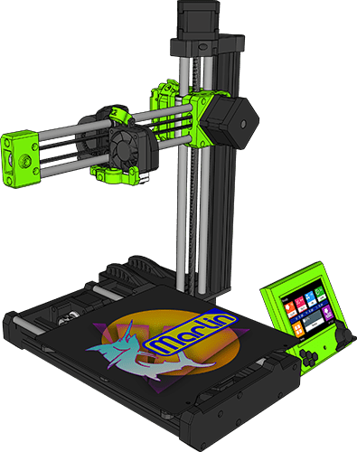

<h1 align="center">DIY Prusa Mini Marlin Firmware</h1>

    
    
    
    
    
     
    

> [!WARNING]
> This is a work in progress and parts list will likely change.

## Configuring DIY Prusa Mini Firmware

To configure this firmware, enable options in [`DIY_Prusa_Mini_Configuration.h`](Marlin/DIY_Prusa_Mini_Configuration.h). No other config file editing is required!

## Building DIY Prusa Mini Firmware

To build this firmware, you'll need [Visual Studio Code](https://code.visualstudio.com/) with [PlatformIO](https://docs.platformio.org/en/latest/integration/ide/vscode.html#platformio-ide-for-vscode). Detailed setup instructions can be found in the [Installing Marlin (PlatformIO with VSCode)](https://marlinfw.org/docs/basics/install_platformio_vscode.html) guide.

## Specs

This firmware is configured for a DIY Prusa Mini powered by the following hardware:

### Frame
* [Prusa Mini 3030 Extrusion, Y carriage, Z bottom plate, 10mm & 8mm rods](https://www.aliexpress.com/item/2255800461956892.html)
* [Prusa Mini hardware kit](https://www.aliexpress.com/item/2255800703957883.html)

### Motherboard
* [BigTreeTech SKR Mini E3 V3/V3.01](https://biqu.equipment/collections/control-board/products/bigtreetech-skr-mini-e3-v2-0-32-bit-control-board-for-ender-3?variant=39982232174690) or [BigTreeTech SKR Mini E3 V2](https://www.biqu.equipment/products/bigtreetech-skr-mini-e3-v2-0-32-bit-control-board-integrated-tmc2209-uart-for-ender-3)
* Modded Prusa Mini control box (link tbd)

### Power
* [MEAN WELL 24V 160W 6.67A GST160A24-R7B desktop AC->DC power adapter](https://www.mouser.com/ProductDetail/MEAN-WELL/GST160A24-R7B?qs=XfZQyRplo5SmNuFq2sVqQA%3D%3D)
* [Kycon KPJX-PM-4S DC power connector](https://www.mouser.com/ProductDetail/Kycon/KPJX-PM-4S?qs=zorda86t5M%2Fdp%252BTtr6by2g%3D%3D)

### Hotend / Extruder
 * [Prusa Mini heatsink](https://www.prusa3d.com/product/hotend-heatsink-mini/)
 * [Prusa Mini heaterblock](https://www.prusa3d.com/product/hotend-heaterblock-mini/)
 * [Bondtech Prusa Mini heatbreak](https://www.bondtech.se/product/bondtech-heat-break-for-prusa-mini/)
 * Stock extruder or [Bondtech Prusa Mini IFS extruder](https://www.bondtech.se/product/ifs-extruder-for-prusa-mini/)
 * [Prusa Mini PTFE](https://www.prusa3d.com/product/extruder-print-head-ptfe-tube-mini/)
 * [Mechatronics G4010L24B-RSR 24v 40mm](https://www.digikey.com/en/products/detail/G4010L24B-RSR/1570-G4010L24B-RSR-ND/11492597) hotend cooling fan
 * [SoundOriginal 24V 5015](https://www.amazon.com/dp/B0755BY9RH) parts cooling fan
 * [SuperPINDA probe](https://www.prusa3d.com/product/superpinda/) (Pepperl+Fuchs NBN2,5-8GM35-E1L-Y)

### Bed
* Original Prusa Magnetic heatbed MINI/+ 24V (assembly) [Printed Solid](https://www.printedsolid.com/products/original-prusa-magnetic-heatbed-mini-24v-assembly) | [AliExpress](https://www.aliexpress.us/item/2255800712071652.html)
* [Original Prusa Mini Spring Steel Sheet With Smooth Double-sided PEI](https://www.printedsolid.com/products/original-prusa-mini-spring-steel-sheet-with-smooth-double-sided-pei)
* [Original Prusa Mini Double-sided Textured PEI Powder-coated Spring Steel Sheet](https://www.printedsolid.com/products/original-prusa-mini-double-sided-textured-pei-powder-coated-spring-steel-sheet)
* [Original Prusa Mini Double-sided Powder-coated PEI SATIN Spring Steel Sheet](https://www.printedsolid.com/products/original-prusa-mini-double-sided-powder-coated-pei-satin-spring-steel-sheet)

### LCD Controller
* [BigTreeTech TFT35 E3 V3](https://www.biqu.equipment/collections/lcd/products/btt-tft35-e3-v3-0-display-touch-screen-two-working-modes)
* Modded Prusa Mini Ender LCD Remix mount (link tbd)

### Steppers
* **X-axis:** [LDO COOLER LDO-42STH40-1004ASR](https://www.printedsolid.com/products/ldo-nema-17-motor-cooler-ldo-42sth40-1004asr) 1.8°
* **Y-axis:** [LDO COOLER LDO-42STH40-1004ASR](https://www.printedsolid.com/products/ldo-nema-17-motor-cooler-ldo-42sth40-1004asr) 1.8°
* **Z-axis:** [LDO LDO-42STH34-1004L321EC](https://www.printedsolid.com/products/ldo-nema-17-motor-mk3-z-motor-qlink-ldo-42sth34-1004l321ec) 1.8° with integrated leadscrew
* **E-axis:** [LDO COOLER LDO-42STH40-1004ASR](https://www.printedsolid.com/products/ldo-nema-17-motor-cooler-ldo-42sth40-1004asr) 1.8°
<!-- * **Extruder:** [LDO SLIM POWER LDO-42STH25-1404MAC](https://www.printedsolid.com/products/ldo-nema-17-motor-pancake-ldo-42sth25-1404) 0.9° //-->

### Motion System
* **X-axis** [Gates 2GT PowerGrip belt](https://www.prusa3d.com/product/belt-x-axis/)
* **Y-axis** [Gates 2GT PowerGrip belt](https://www.prusa3d.com/product/belt-y-axis/)
* 2 x [Timing pulley T16-2GT](https://www.prusa3d.com/product/timing-pulley-t16-2gt/)
* 2 x [Bearing housing 623h](https://www.prusa3d.com/product/bearing-housing-623h/)
* [LM8UU & LM10LUU bearing package](https://www.aliexpress.com/item/2255800569099702.html)

## SuperPINDA Wiring

| SKR Mini E3 V2 & V3 Z-Probe Connector | SKR Mini E3 V3.01  Z-Probe Connector | SuperPINDA Wire Colors |
|:-:|:-:|:-:|
| PC1 | PA1 | BLACK |
| GND | GND | BLUE  |
| PA1 | PA0 | -     |
| +5V | +5V | BROWN |
| GND | GND | -     |

## Credits

If you find this project helpful, please consider donating!

 - Keith Bennett [[thisiskeithb](https://github.com/thisiskeithb)], DIY Prusa Mini Creator - [💸 Github Sponsors](https://github.com/sponsors/thisiskeithb) / [☕ Ko-fi](https://ko-fi.com/thisiskeithb)

First layer calibration based on [Prusa's MK3/S/+ "meander" first layer calibration](https://github.com/prusa3d/Prusa-Firmware/blob/MK3/Firmware/first_lay_cal.cpp). <!-- TODO: Port Prusa Mini-specific coordinates -->

## Star History

<a id="starchart" href="https://star-history.com/#MarlinFirmware/Marlin&Date">
  <picture>
    <source media="(prefers-color-scheme: dark)" srcset="https://api.star-history.com/svg?repos=MarlinFirmware/Marlin&type=Date&theme=dark" />
    <source media="(prefers-color-scheme: light)" srcset="https://api.star-history.com/svg?repos=MarlinFirmware/Marlin&type=Date" />
    
  </picture>
</a>

## License

Marlin and the DIY Prusa Mini Firmware is published under the [GPL license](/LICENSE) because we believe in open development.
